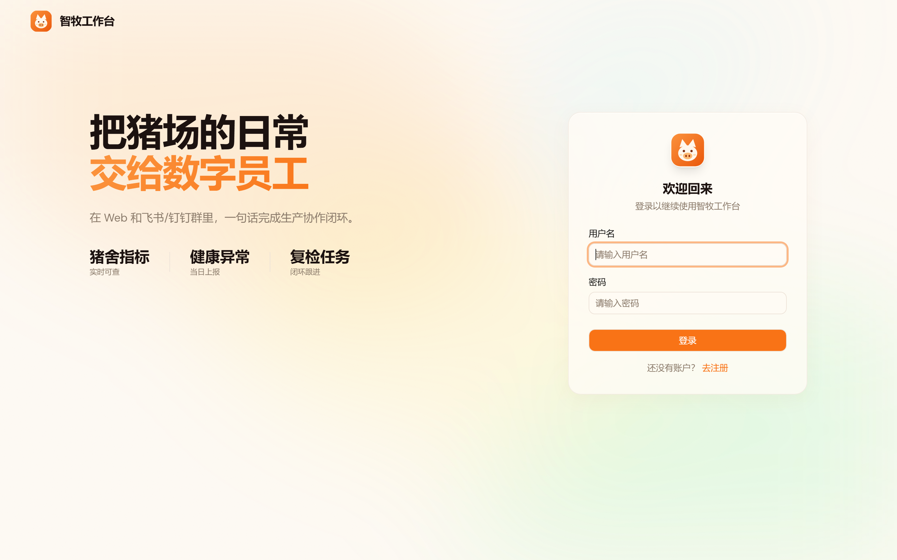
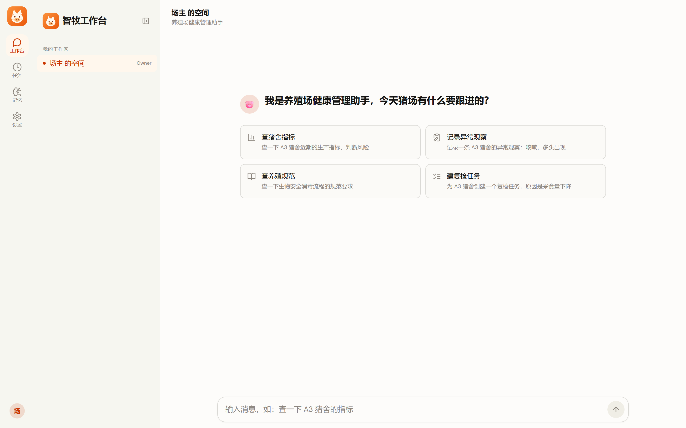

# CrewClaw

**面向养殖场生产协作的多渠道数字员工平台。** 团队成员通过 Web、飞书、钉钉与岗位 Agent 协作：查询猪舍生产指标、上报健康异常、创建复检任务、沉淀团队记忆，一句话完成生产协作闭环。

<p align="center">
  
  
</p>

Agent 执行内核复用开源 [Pi Agent Runtime](https://www.npmjs.com/package/@earendil-works/pi-coding-agent)（`@earendil-works/pi-coding-agent`）；平台层——认证、多用户工作区、身份建模、渠道网关、记忆、权限确认、定时任务、模型接入——全部在本仓库实现。

## 功能

### 三端接入

- **Web 工作台**：React 19 + Tailwind 4 工作台界面，SSE 流式对话（打字机、思考块、工具活动卡、写操作确认卡），Markdown / Mermaid / 公式渲染，深浅色与多种配色。
- **飞书**：长连接网关接入，群聊 @机器人 即可对话，Agent 回复直接回到群里；每个工作区可接入自己的飞书应用。
- **钉钉**：Stream 模式机器人接入，与飞书共用同一套 `IMChannel` 渠道契约与消息管线。

三端消息进入同一处理管线，会话按「渠道 + 账号 + 对话 + 话题」复合键隔离：同键串行、跨键并行，同平台多机器人并存互不串扰；群聊默认要求 @机器人才响应。

### 多用户工作区

- 注册 / 登录：scrypt 密码哈希 + HMAC cookie 会话 + 登录限流。
- owner / admin / member 三级角色：管理员维护成员、角色 Agent、渠道与定时任务；普通成员协作对话、贡献团队记忆。
- 渠道凭据 AES-256-GCM 加密落盘，界面永不回显。

### 岗位 Agent 与身份注入

- 四段 Prompt 体系（IDENTITY / SOUL / AGENTS / TOOLS）：契约校验、固定顺序拼装、双层哈希、token 预算。
- 身份变更 hash + version 可审计传播，编辑即留档，不可变快照可回溯。
- 对话仍以「渠道 + 账号 + 对话 + 话题」复合键寻址，跨渠道互不污染。

### 业务工具与权限确认

- 内置养殖场景工具：猪舍指标查询、养殖规范检索、异常观察记录、复检任务创建。
- 权限门 readonly / ask / fail-closed：写操作被拦截 → 前端确认卡 → 用户裁决 → 确认回路执行（10 分钟 TTL）。
- 工具调用审计：记录工作区、会话、Agent 与操作人。

### 团队记忆

- Workspace 共享记忆 + 会话内记忆双作用域；`recall` / `remember` 工具接入 Agent 回路，与记忆页同库同管线。
- CAS 乐观锁（冲突检测）、不可变修订史、FTS 中文检索、墓碑软删。

### 定时任务

- 单实例调度器：游标 + 乐观锁领取、幂等物化、周期错过记 missed 不补跑、一次性必达；执行结果回写工作区对话；与用户对话同工作区串行。

### 模型接入（复用 Pi 原生机制）

- **自定义接口**：任意 OpenAI 兼容 `baseUrl` + `key`，配置写入 Pi 原生的 `agent/models.json` + `agent/auth.json`，自包含、不碰全局 `~/.pi/`。
- **订阅套餐**：内置 Anthropic Claude、OpenAI Codex、GitHub Copilot、OpenRouter、Kimi Coding 等套餐的 OAuth 登录，在 Web 设置页完成授权、选择模型并一键启用。

## 架构

```
Web 工作台（SSE）──────┐
飞书群 @机器人 ────────┤
钉钉群 @机器人 ────────┤
                       ▼
          Hono 服务端（认证 / 工作区 / 记忆 / 任务 / 设置 API / 静态托管）
                       │
             createPiRuntime()   ← Agent 内核 = Pi Agent Runtime
                       │
           Agent 决策 → 业务工具 → 权限门判定 → 结果回传 / 回发渠道
```

最小业务链路：

```text
群聊上报 A3 猪舍采食量下降并出现咳嗽
→ 健康管理 Agent 查询近期指标（query_pen_metrics）
→ 检索规范和历史记忆（query_operation_sop / recall）
→ 记录现场观察（record_health_observation，自动执行并审计）
→ 创建复检任务并等待负责人确认（create_inspection_task，ask 确认回路）
→ 任务结果回写工作区，供后续日报继续使用
```

## 快速开始

```bash
# 1. 安装依赖
npm install
npm --prefix web install

# 2. 配置模型接入（二选一，也可启动后在 Web 设置页配置）
cp .env.example .env   # 填 OpenAI 兼容接口的 baseUrl / key / 模型名

# 3. 构建前端
npm run web:build

# 4. 启动
npm run dev            # http://127.0.0.1:3000，注册账号即可使用
```

### 接入飞书 / 钉钉

在飞书开放平台创建应用（事件订阅选「长连接」）或在钉钉开放平台创建企业内部机器人（Stream 模式），把凭据填入 `.env` 或在 Web 设置页按工作区配置，重启后网关自动常驻连接：

```bash
FEISHU_APP_ID=xxx
FEISHU_APP_SECRET=xxx
DINGTALK_CLIENT_ID=xxx
DINGTALK_CLIENT_SECRET=xxx
```

群聊默认要求 @机器人才响应（`GROUP_REQUIRE_MENTION=0` 可关闭）。

### 联调脚本

```bash
npm run hello        # 进程内直调 Pi，一句问答
npm run tool-demo -- '查询 A3 猪舍今天的生产指标，并判断是否需要复检'
npm run tool-demo -- '为 A3 创建复检任务'   # 应被权限门拦截，需确认
npm run mem-demo     # 多轮记忆：记住名字 → 第二问答名字
```

## 测试

```bash
npm test             # vitest：16 个文件 223 个用例
```

覆盖：身份模型与传播、Prompt 契约、记忆 CAS 与检索、权限门与确认回路、调度器幂等、渠道网关与会话路由、模型接入、服务端集成等。

## 结构

```text
crewclaw/
├─ src/
│  ├─ index.ts           # 启动入口（组装 server + 网关 + 调度器）
│  ├─ server.ts          # Hono 应用工厂（SSE 对话 + 管理 API + 静态托管，可注入 db 测试）
│  ├─ core/              # 平台底座
│  │  ├─ database.ts     # SQLite 版本化三层迁移（版本头/ensureColumn/断言/备份）
│  │  ├─ models.ts       # Workspace/成员/Agent 绑定 + 三层身份模型 + 版本快照
│  │  ├─ auth.ts         # scrypt 密码 + HMAC cookie 会话 + 登录限流
│  │  ├─ secret-box.ts   # AES-256-GCM 渠道凭据加密
│  │  ├─ runtime-context.ts # 回合上下文（AsyncLocalStorage：工作区/会话/操作人）
│  │  └─ serial.ts       # 同工作区串行队列
│  ├─ agent/             # Agent 运行时
│  │  ├─ agent-runtime.ts   # Pi 调用封装（共享 ModelRuntime，按名建会话 + 压缩 + 身份注入）
│  │  ├─ prompt.ts       # 四段 Prompt（契约/拼装/双层哈希/token 预算）
│  │  ├─ persona.ts      # 集成桥：Profile→四段拼装→注入 Pi
│  │  └─ provider-config.ts # 模型接入：models.json/auth.json + 订阅套餐登录/启用
│  ├─ memory/            # 团队与会话记忆
│  │  ├─ memory.ts       # 四类知识/CAS/幂等/FTS/墓碑/修订史
│  │  └─ memory-tools.ts # Agent 记忆工具（recall/remember）
│  ├─ channels/          # 多渠道接入
│  │  ├─ channel.ts      # IMChannel 统一契约 + ChannelManager（多账号）+ 复合会话键
│  │  ├─ session-router.ts  # 复合会话键 → 独立会话；同键串行、跨键并行、身份变更重建
│  │  ├─ gateway.ts      # 渠道网关：常驻连接 + 群聊 @ 门控 + 入站路由/回发 + 历史落库
│  │  ├─ feishu-channel.ts  # 飞书渠道适配器
│  │  └─ dingtalk-channel.ts # 钉钉渠道适配器
│  ├─ permissions/       # 权限与确认
│  │  ├─ permission.ts   # 权限门（readonly/ask/execute/fail-closed）
│  │  └─ permission-loop.ts # 写操作确认回路（待确认登记 → 用户裁决 → 执行）
│  ├─ tasks/
│  │  └─ scheduler.ts    # 定时任务调度器（游标+乐观锁领取/幂等物化/错过不补跑）
│  ├─ farm/              # 养殖场景适配层
│  │  ├─ farm-domain.ts  # 猪舍指标/养殖规范/异常观察/复检任务（内置模拟数据）
│  │  └─ tools.ts        # 业务工具（query_pen_metrics / create_inspection_task 等）
│  └─ examples/          # 联调脚本（hello/tool/mem/persona/lifecycle/feishu）
├─ web/                  # React 19 + Vite 前端（构建产物 web/dist 由后端托管）
├─ tests/                # vitest（16 文件 223 用例）
├─ docs/                 # 设计与实施记录、项目截图
└─ agent/models.json     # Pi 原生 provider 配置（自包含）
```

## 技术取舍

| 取舍 | 说明 |
|---|---|
| 复用 Pi 而非自造引擎 | Agent 内核用 `@earendil-works/pi-coding-agent`，平台层自写；不自称自研 LLM 引擎 |
| 进程内直调 | 同进程调用 Pi SDK，不做跨进程 IPC，换取简单可控 |
| 配置自包含 | `agent/models.json` + `.env` 均在本项目内；不碰全局 `~/.pi/`，不影响其他 Agent 工具 |
| 记忆非 RAG | 结构化存储 + FTS/LIKE 关键词检索，不引入向量库；适合团队事实与经验沉淀场景 |
| 模拟业务数据 | 猪场业务数据为内置模拟数据（`src/farm-domain.ts`），不接入真实猪场 ERP/MES/物联网设备 |
| 业务安全 | Agent 只做异常识别、规范检索和任务建议；不自动诊断疾病、不开具处方、不执行用药 |
| 后置项 | Docker 部署、容器沙箱、跨组织多租户隔离、向量检索（刻意后置） |

## License

MIT
